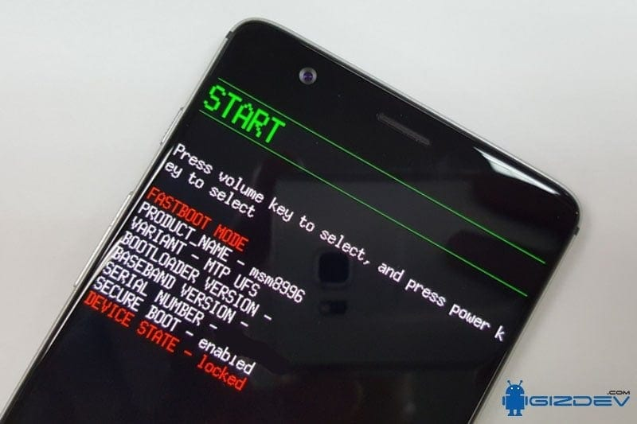
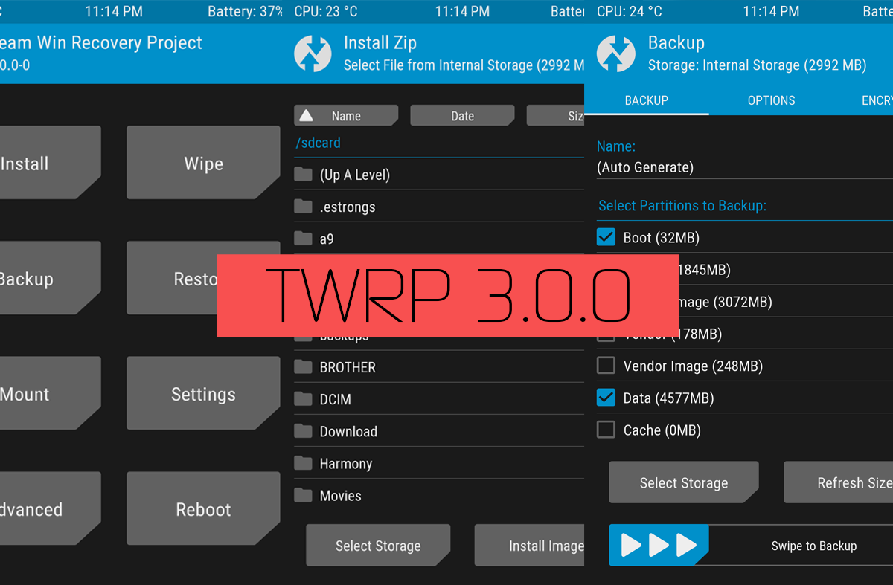
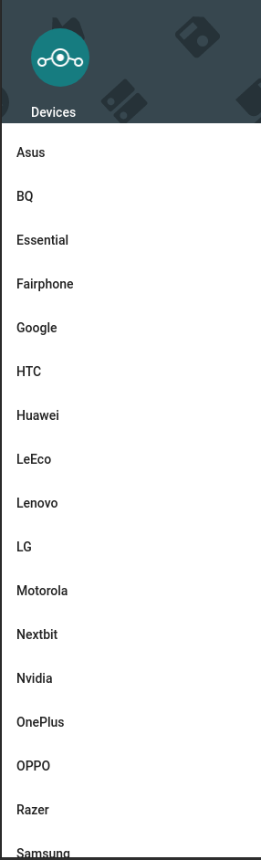
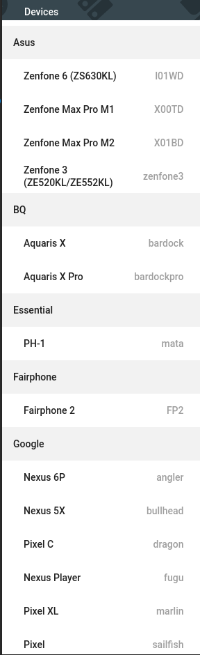
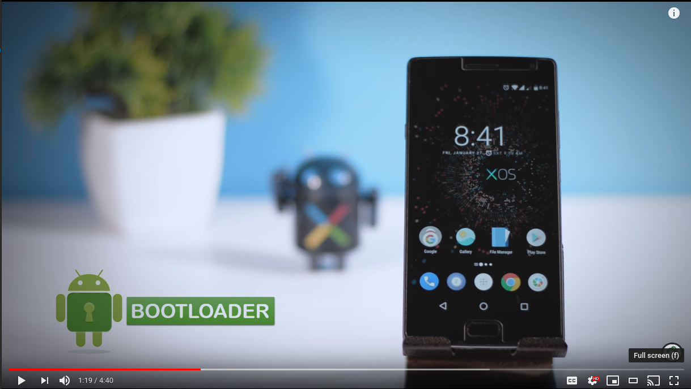

---
title:
- Lineage Os LIN 2019
author:
- David Lopez, Andres Cardenal 
theme:
- Copenhagen
---

[//]: <> (https://forum.xda-developers.com/chef-central/android/guide-android-rom-development-t2814763)
# LineageOs

\ 

# Indice

1. Introduccion
2. Contribuir a LineageOS
3. Instalar LineageOS

# Introduccion

1. Contexto
2. Historia
3. Curiosidades
4. Referencias

# Contexto
1. LineageOs
2. Software libre
	
# LineageOS

## Qué es LineageOs?

LineageOs es sistema operativo que se trata de un fork de
Android, por tanto, es software libre y está orientado a su
uso en teléfonos inteligentes y tabletas.

# Que es el software libre? 

## Informacion a cerca del software libre

Oli :)

# Fork 

## Qué es un Fork?

Fork en castellano, bifurcación, se trata de una distribución
no oficial de un proyecto de software. La bifurcación se
asienta sobre el código original ampliándolo o modificándolo
significativamente.

# Historia

Todo empezó con...

+ CyanogenMod
+ Fork a Lineage

# CyanogenMod

## CyanogenMod

+ HTC Dream
	- Se logra escalar privilegios (root)
+ Ventajas sobre el Android convencional
	- *El elixir de la eterna juventud*
+ Popularizacion
	- 50 millones de instalaciones en 2013...
+ Versiones de CyanogenMod 
	- Cyanogenmod 3 - 14.1 (Android 1.5 hasta 7.1.x)
+ Comercializacion
	- El inicio del fin
+ Fork a Lineage

# Contribuir a LineageOs

Aqui habra informacion sobre contribuir a lineage :)

# Instalacion 

+ *Puedes intentarlo, siempre que no tengas un iphone...*


Como instalar

1. Requisitos 
2. Instalacion

# (Pre)Requisitos

*Sin esto...no vamos bien...*

1. Bootloader desbloqueado
2. Custom recovery instalada 

# Besbloquear bootloader

*O cambiarte de movil en el intento*

## Metodo: Fastboot & ADB
	Atencion, esto hara reset de fabrica y   
		violara la garantia
	1. Obtener ADB y fastboot
	2. Habilitar opciones de desarrollador
	2.1 Habilitar USB debugging
	2.2 Habilitar desbloqueo OEM
	3. Conectar el telefono por usb y   
		permitir el USB debugging
	4. (Paso critico) ``` adb reboot bootloader ```
	5. ```fastboot flashing/oem unlock```
	6. ```fastboot reboot```
# Bootloader

## El bootloader es algo como:


# Custom Recovery (TWRP)

+ *Importante, descargar el twrp valido para tu movil,  
	si no, experimentar...*

## Metodo: ADB y Fastboot
	1. Adb reboot bootloader
	2. fastboot flash recovery archivo_con_tu_twrp
	3. fastboot reboot

## Metodo 2: TWRP Manager (app)
	Mas sencillo que la anterior, si tu movil  
	es compatible...
	1. Descargar la app y seguir los pasos...

https://www.xda-developers.com/how-to-install-twrp/ 

# TWRP

## TWRP se parece a:


# Instalacion!

1. Obtener la ROM...facil...no?
2. Gapps? Huimos de google para volver a el?
3. Instalar

# Obtener la ROM

1. Oficial de LineageOs
2. Foro de XDA Developers

# Oficial de LineageOs




# Foro de XDA Developers


# Instalar (como yo lo hago)

* Guardar la ROM en una sd externa
* Insertar la SD y bootear a twrp
* (Backup?)
* Wipe
* Install: seleccionar la ROM (y las GAPPS)

# Video de apoyo:

[](https://www.youtube.com/watch?v=5snxtA5e2RY "install lineage os")
